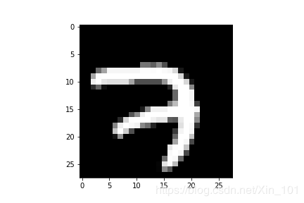

# 深度学习介绍及应用分析
## 一. 深度学习简介
### 1. 概念
深度学习，主要就是多层神经网络。而多层神经网络目前效果比较好的是卷积神经网络，目前在图像和音频信号上效果比较好，而在自然语言处理上效果没有显示出来。深度学习从统计学的角度来说,就是在预测数据的分布，从数据中学得一个模型然后再通过这个模型去预测新的数据，这一点就要求测试数据和训练数据必须是同分布。从Inception的角度上来看的话，其实深度学习是在模拟人脑的工作机制。

深度学习又分为卷积神经网络（Convolutional neural networks，简称CNN）和深度置信网（Deep Belief Nets，简称DBN）。其主要的思想就是模拟人的神经元，每个神经元接受到信息，处理完后传递给与之相邻的所有神经元即可。处理方式如下图所示

神经网络的计算量非常大，事实上在很长时间里由于基础设施技术的限制进展并不大。而GPU的出现让人看到了曙光，也造就了深度学习的蓬勃发展。
### 2. 背景
机器学习（Machine Learning）是一门专门研究计算机怎样模拟或实现人类的学习行为，以获取新的知识或技能，重新组织已有的知识结构使之不断改善自身的性能的学科。从开始的通过传感器（例如CMOS）来获得数据。然后经过预处理、特征提取、特征选择，再到推理、预测或者识别。最后一个部分，也就是机器学习的部分，绝大部分的工作是在这方面做的，也存在很多的paper和研究。
而中间的三部分，概括起来就是特征表达。良好的特征表达，对最终算法的准确性起了非常关键的作用，而且系统主要的计算和测试工作都耗在这一大部分。但，这块实际中一般都是人工完成的，是靠人工提取特征。

然而，手工地选取特征是一件非常费力、启发式（需要专业知识）的方法，能不能选取好很大程度上靠经验和运气，而且它的调节需要大量的时间。所以这个时候的深度学习就慢慢的出现了。
### 3. 常见的学习方式
1. 监督式学习：在监督式学习下，输入数据被称为“训练数据”，每组训练数据有一个明确的标识或结果，如对防垃圾邮件系统中“垃圾邮件”“非垃圾邮件”，对手写 数字识别中的”“1”，“2”，“3”，“4”等。在建立预测模型的时候，监督式学习建立一个学习过程，将预测结果与“训练数据”的实际结果进行比较，不断
 的调整预测模型，直到模型的预测结果达到一个预期的准确率。监督式学习的常见应用场景如分类问题和回归问题。常见算法有逻辑回归（Logistic Regression）和反向传递神经网络（Back Propagation Neural Network）。
2. 非监督式学习：在非监督式学习中，数据并不被特别标识，学习模型是为了推断出数据的一些内在结构。常见的应用场景包括关联规则的学习以及聚类等。常见算法包括Apriori算法以及k-Means算法。

3. 半监督式学习：在此学习方式下，输入数据部分被标识，部分没有被标识，这种学习模型可以用来进行预测，但是模型首先需要学习数据的内在结构以便合理的组织数据 来进行预测。应用场景包括分类和回归，算法包括一些对常用监督式学习算法的延伸，这些算法首先试图对未标识数据进行建模，在此基础上再对标识的数据进行预 测。如图论推理算法（Graph Inference）或者拉普拉斯支持向量机（Laplacian SVM.）等。
4. 强化学习：在这种学习模式下，输入数据作为对模型的反馈，不像监督模型那样，输入数据仅仅是作为一个检查模型对错的方式，在强化学习下，输入数据直接反馈 到模型，模型必须对此立刻作出调整。常见的应用场景包括动态系统以及机器人控制等。常见算法包括Q-Learning以及时间差学习（Temporal difference learning）。
## 二. 深度学习框架
### 1. TensorFlow  
Google不仅是大数据和云计算的领导者，在机器学习和深度学习上也有很好的实践和积累，在2015年年底开源了内部使用的深度学习框架TensorFlow。与Caffe、Theano、Torch、MXNet等框架相比，TensorFlow在Github上Fork数和Star数都是最多的，而且在图形分类、音频处理、推荐系统和自然语言处理等场景下都有丰富的应用。最近流行的Keras框架底层默认使用TensorFlow，著名的斯坦福CS231n课程使用TensorFlow作为授课和作业的编程语言，国内外多本TensorFlow书籍已经在筹备或者发售中，AlphaGo开发团队Deepmind也计划将神经网络应用迁移到TensorFlow中，这无不印证了TensorFlow在业界的流行程度。
### 2. PaddlePaddle
PaddlePaddle是百度研发的开源开放的深度学习平台，是国内最早开源、也是当前唯一一个功能完备的深度学习平台。依托百度业务场景的长期锤炼，PaddlePaddle有最全面的官方支持的工业级应用模型，涵盖自然语言处理、计算机视觉、推荐引擎等多个领域，并开放多个领先的预训练中文模型，以及多个在国际范围内取得竞赛冠军的算法模型。
PaddlePaddle同时支持稠密参数和稀疏参数场景的超大规模深度学习并行训练，支持千亿规模参数、数百个几点的高效并行训练，也是最早提供如此强大的深度学习并行技术的深度学习框架。PaddlePaddle拥有强大的多端部署能力，支持服务器端、移动端等多种异构硬件设备的高速推理，预测性能有显著优势。PaddlePaddle已经实现了API的稳定和向后兼容，具有完善的中英双语使用文档，形成了易学易用、简洁高效的技术特色。
### 3. Caffe
和Tensorflow名气一样大的是深度学习框架Caffe，由加州大学伯克利的Phd贾扬清开发，全称是Convolutional Architecture for Fast Feature Embedding，是一个清晰而高效的开源深度学习框架，由伯克利视觉中心(Berkeley Vision and Learning Center，BVLC)进行维护。从它的名字就可以看出其对于卷积网络的支持特别好，同时也是用C++写的，提供的C++接口，也提供了matlab接口和python接口。 
## 三. 基于深度学习框架的MINST数字识别
### MINST简介
是大型的手写数字数据集,用于训练多样的图像处理系统,数据集广泛应用于机器学习领域的训练和测试,数据集通过对MNIST的原始数据集进行re-mixing而来,作者认为MNIST的训练数据集是来自美国人口调查局,而测试数据集来自高中生,所以该数据集并不能完全适用于机器学习的实验.该数据集中的NIST黑白图通过归一化处理,使其匹配到28×28像素的边框中,并进行反锯齿处理。MNIST数据集包含60000张训练图片和10000张测试图片,其中一半的训练数据和一半的测试数据取自MNIST的训练数据集，另外一半来自MNIST的测试数据集。有大量的科技论文在该数据集上试图达到最低错误率,其中一篇论文使用卷积神经网络的分层系统，在MNIST数据集上错误率为0.23%.数据集作者的文章中,使用支持向量机方法的错误率为0.8%,扩展的类似MNIST数据集成为EMNIST于2017年发布，该数据集包含240000训练数据，40000测试数据。
### 数据读取
1. MNIST图像数据引入:from tensorflow.examples.tutorials.mnist import input_data
2. MNIST数据读取:mnist = input_data.read_data_sets("../mnist_data", one_hot=True)
3. 获取训练图像数据及标签:mnist.train.images,mnist.train.labels
4. 获取测试图像数据及标签:mnist.test.images,mnist.test.labels
5. MNIST数据集结构:图像数据和标签均为列向量。
### 结果显示
训练数据图像：

测试数据图像:

## 四. 深度学习应用分析
深度学习已经在图像、语音、自然语言处理等各个不同的领域展现出了优异的性能。下面将介绍深度学习在机器视觉领域的应用现状及其他方面的应用。
### 物体检测
物体检测是从图像中确定物体的位置，并进行分类的问题，如下图所示要从图像中确定物体的种类和物体的位置。

不难发现，物体检测比物体识别（以整个图像为对象进行识别）更难，因为物体检测需要对图像中的每种类别进行识别并判断其位置。人们提出了多个基于CNN的方法，其中一个较为有名的方法是R-CNN，下图显示了R-CNN的处理流。图中，“2.Extract region proposals”（候选区域的提取）和“3.Compute CNN features”（CNN特征的计算）的处理部分。这里，首先以某种方法找出形似物体的区域，然后对提取的区域应用CNN进行分类。R-CNN中会将图像变形为正方形，或者在分类时使用SVM（支持向量机）。
### 图像分割
图像分割是指在像素水平上对图像进行分类。如下图所示，使用像素为单位对各个对象分别着色的监督数据进行学习，然后，在推理时，对输入图像的所有像素进行分类。

如果选择神经网络进行图像分割，最简单的方法是以所有像素为对象，对每个像素执行推理处理（比如准备一个对某个矩形区域中心的像素进行分类的网络，以所有像素为对象执行推理处理。
## 五. 总结与体会
通过人工智能课程的学习，我学到了很多关于深度学习方面的知识和理论，在此基础上学到了卷积神经网络、深度神经网络、循环神经网络的基本概念和工作原理，当然也学习了各种算法，比如梯度下降算法等等。在课程的学习中，在慕课中了解到PaddlePaddle框架和TensorFlow框架的工作原理，并在这个基础上实现了手写数字识别等等应用。当然我还知道了深度学习常见的学习方式。不过，要学好深度学习，首先得有良好的数学知识和代码，因为中间有很多的算法和理论知识，不容易理解，学习的时候也会有些吃力，所以在学习的过程中，经常搜索相关知识，扩展自己的知识层面，并能快速的理解内容和实践。而且我知道只有深入理解了线性回归、逻辑回归，才能更好地理解神经网络，然后一步一步踏实地学习。除此之外，学习一个模型，很重要的一点就是要自己推导一遍公式，用代码实现一次模型。总的来说，收获很多，并且丰富了自己的知识领域，希望自己能够学到更多关于深度学习方面的知识，并灵活运用。在后面的学习中我也会更加努力，学习更多的知识，慢慢提升自己的能力和潜力。