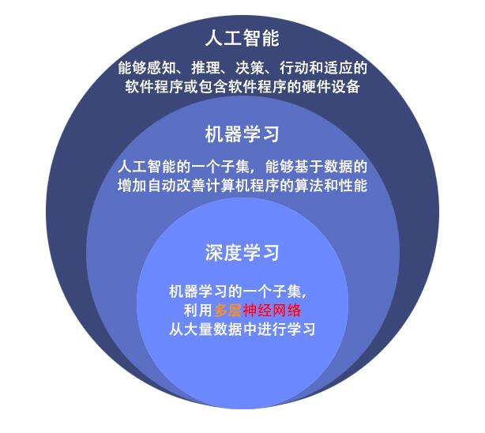

# <center>深度学习设计报告<center> 
###  <center>201702042 傅思康<center> 

## 1.  深度学习概述
### 1.1 深度学习概念
对于“深度学习”这个术语，一个粗浅的定义是“主要使用深度神经网络为工具的机器学习算法”。深度学习首先是一类机器学习的方法，因为它和其他机器学习方法一样允许计算机从样本中、从实例中、从数据中使用统计手段“学习”出规律来，而不用像专家系统和其他符号主义的方法一样人工定义规则。其次，深度学习不同于其他机器学习方法的地方，在于它主要的工具，或者说使用到的数学模型是深度神经网络。他与机器学习和人工智能的关系如图所示:

机械学习是指多领域交叉学科，涉及概率论、统计学、逼近论、凸分析、算法复杂度理论等多门学科。专门研究计算机怎样模拟或实现人类的学习行为，以获取新的知识或技能，重新组织已有的知识结构使之不断改善自身的性能。

### 1.2 深度学习领域
#### 1.2.1 计算机视觉
##### （1） 目标检测

目标检测（Object Detection）是当前计算机视觉和机器学习领域的研究热点之一，核心任务是筛选出给定图像中所有感兴趣的目标，确定其位置和大小。其中难点便是遮挡，光照，姿态等造成的像素级误差，这是目标检测所要挑战和避免的问题。现如今深度学习中一般通过搭建DNN提取目标特征，利用ROI映射和IoU确定阈值以及区域建议网络RPN统一坐标回归损失和二分类损失来联合训练。
##### （2）语义分割

语义分割（Semantic Segmentation）旨在将图像中的物体作为可解释的语义类别，该类别将是DNN学习的特征聚类得到。和目标检测一样，在深度学习中需要IoU作为评价指标评估设计的语义分割网络。值得注意的是，语义类别对应于不同的颜色，生成的结果需要和原始的标注图像相比较，较为一致才能算是一个可分辨不同语义信息的网络。
##### （3）超分辨率重建

超分辨率重建（Super Resolution Construction）的主要任务是通过软件和硬件的方法，从观测到的低分辨率图像重建出高分辨率图像，这样的技术在医疗影像和视频编码通信中十分重要。该领域一般分为单图像超分和视频超分，一般在视频序列中通过该技术解决丢帧，帧图像模糊等问题，而在单图像在中主要为了提升细节和质感。在深度学习中一般采用残差形式网络学习双二次或双三次下采样带来的精度损失，以提升大图细节；对于视频超分一般采用光流或者运动补偿来解决帧图像的重建任务。
##### （4）行人重识别

行人重识别（Person Re-identification）也称行人再识别，是利用计算机视觉技术判断图像或者视频序列中是否存在特定行人的技术。其广泛被认为是一个图像检索的子问题。核心任务是给定一个监控行人图像，检索跨设备下的该行人图像。现如今一般人脸识别和该技术进行联合，用于在人脸识别的辅助以及人脸识别失效（人脸模糊，人脸被遮挡）时发挥作用。在深度学习中一般通过全局和局部特征提取和以及度量学习对多组行人图片进行分类和身份查询。
#### 1.2.2. 语音识别

语音识别（Speech Recognization）是一门交叉学科，近十几年进步显著。除了需要数字信号处理，模式识别，概率论等理论知识，深度学习的发展也使其有了很大幅度的效果提升。深度学习中将声音转化为比特的目的类似于在计算机视觉中处理图像数据一样，转换为特征向量，与图像处理不太一样的是需要对波（声音的形式）进行采样，采样的方式，采样点的个数和坐标也是关键信息，然后对这些数字信息进行处理输入到网络中进行训练，得到一个可以进行语音识别的模型。语音识别的难点有很多，例如克服发音音节相似度高进行精准识别，实时语音转写等，这就需要很多不同人样本的声音作为数据集来让深度网络具有更强的泛化性，以及需要设计的网络本身的复杂程度是否得当等条件。
#### 1.2.3. 自然语言处理(NLP)

自然语言处理（NLP）是计算机科学和人工智能领域的方向之一，研究能实现人与计算机之间用自然语言进行有效通信的各种理论和方法。深度学习由于其非线性的复杂结构，将低维稠密且连续的向量表示为不同粒度的语言单元，例如词、短语、句子和文章，让计算机可以理解通过网络模型参与编织的语言，进而使得人类和计算机进行沟通。此外深度学习领域中研究人员使用循环、卷积、递归等神经网络模型对不同的语言单元向量进行组合，获得更大语言单元的表示。不同的向量空间拥有的组合越复杂，计算机越是能处理更加难以理解的语义信息。将人类的文本作为输入，本身就具有挑战性，因此得到的自然语言计算机如何处理就更难上加难，而这也是NLP不断探索的领域。通过深度学习，人们已经在AI领域向前迈出一大步，相信人与机器沟通中“信、达、雅”这三个方面终将实现。

### 1.3深度学习框架
#### 1.3.1. Caffe

全称是Convolutional Architecture for Fast Feature Embedding，它是一个清晰、高效的深度学习框架，核心语言是C++并支持命令行、Python和MATLAB接口，然而比较困难的是搭建环境和代码编写，由于Visual Studio版本更迭以及一些相关必备运行库的编译过程复杂问题，使得使用Caffe的研究人员相较于之前大幅度减少，而且如果希望模型可以在GPU训练，还需要自己实现基于C++和CUDA语言的层，这对于编程难度很大，更加对入门人员不友好。
#### 1.3.2. TensorFlow

一经推出就大获成功的框架，采用静态计算图机制，编程接口支持C++，Java，Go，R和Python，同时也集成了Keras框架的核心内容。此外，TensorFlow由于使用C++ Eigen库，其便可在ARM架构上编译和模型训练，因此可以在各种云服务器和移动设备上进行模型训练，而华为云的多模态开发套件HiLens Kit已经利用TensorFlow这一特点具备了开发框架的搭载，外部接口的管理和算子库封装等功能，可一键部署和一键卸载。可以说TensorFlow使得AI技术在企业中得到了快速发展和广泛关注，也使得越来越多的人使用深度学习进行工作。然而，其缺点也很让人苦恼，一是环境搭建，二是复杂设计，让研究人员针对不断改变的接口有心无力，bug频出。然而，如果具有一个良好的开发平台，就可以解决这些显而易见的问题。例如，全面升级的华为云ModelArts 2.0一站式AI开发与管理平台,通过全流程的自动化升级已有的AI开发模式,让模型训练、模型管理、数据准备、模型推理全链条产生质的飞越。华为云ModelArts 2.0，一方面可以显著提升专业AI开发者的效率,让数据科学家、算法工程师们聚焦基础核心的算法研究与创新,释放他们的无限潜能。另一方面,也可以大幅降低初学者的门槛,让更多的AI爱好者可以快速掌握AI技能,为更多行业创造新价值。
#### 1.3.3. PyTorch

前身是Torch，底层和Torch框架一样，Python重写之后灵活高效，采用动态计算图机制，相比TensorFlow简洁，面向对象，抽象层次高。对于环境搭建可能是最方便的框架之一，因此现如今基本上很多的论文都是PyTorch实现，代码和教程也非常多，对入门人员友好，计算速度快，代码易于阅读。许多企业如今使用PyTorch作为研发框架，不得不说PyTorch真的是一个非常厉害的深度学习工具之一。
#### 1.3.4. Keras

类似接口而非框架，容易上手，研究人员可以在TensorFlow中看到Keras的一些实现，很多初始化方法TensorFlow都可以直接使用Keras函数接口直接调用实现。然而缺点就在于封装过重，不够轻盈，许多代码的bug可能无法显而易见。
#### 1.3.5. Caffe2

继承了Caffe的优点，速度更快，然而还是编译困难，研究人员少，值得一提的是已经并入了PyTorch，因此我们可以在新版本的PyTorch中体会到它的存在。
#### 1.3.6. MXNet

支持语言众多，例如C++，Python，MATLAB，R等，同样可以在集群，移动设备，GPU上部署。MXNet集成了Gluon接口，就如同torchvision之于PyTorch那样，而且支持静态图和动态图。然而由于推广力度不够使其并没有像PyTorch和TensorFlow那样受关注，不过其分布式支持却是非常闪耀的一点。

## 2.人工神经网络
有一种类型网络把各个结点看做是“人工神经元”，这种网络就叫做“人工神经网络”（Artificial Neural Networks）。人工神经元就是受自然神经元静息和动作电位的产生机制启发而建立的一个运算模型。神经元通过位于细胞膜或树突上的突触接受信号。当接受到的信号足够大时（超过某个门限值），神经元被激活然后通过轴突发射信号，发射的信号也许被另一个突触接受，并且可能激活别的神经元。

人工神经元模型已经把自然神经元的复杂性进行了高度抽象的符号性概括。神经元模型基本上包括多个输入（类似突触），这些输入分别被不同的权值相乘（收到的信号强度不同），然后被一个数学函数用来计算决定是否激发神经元。还有一个函数（也许是不变，就是复制）计算人工神经元的输出（有时依赖于某个门限）。人工神经网络把这些人工神经元融合一起用于处理信息。

权值越大表示输入的信号对神经元影响越大。权值可以为负值，意味着输入信号收到了抑制。权值不同那么神经元的计算也不同。通过调整权值可以得到固定输入下需要的输出值。但是当ANN是由成百上千的神经元组成时，手工计算这些权值会变得异常复杂。这时就需要一些算法技巧。调整权重的过程称为“学习”或者“训练”。
ANN的类型和使用方式也有很多种。从McCulloch和Pitts（1943）建立第一个神经元模型起，已经产生了几百个不同的也被称为ANN的模型。这些模型之间的不同 也许是功能不同、也许是接受值和拓扑结构不同、也许是学习算法不同等等。同时也有一些混合模型，这些模型里的神经元有更多在上文中没有提到的属性。由于文章篇幅的原因，我们只讲解使用后向传播算法学习的ANN（Rumelhart and McClelland，1986）来学习合适的权值，这种ANN是所有ANNs里最通用的模型，并且许多模型都是基于它的。
由于ANNs是用来处理信息的，自然它被应用在与信息相关的领域。有许多的ANNs就是对真实神经元网络进行建模，用来研究动物和机器的行为与控制，但是也有许多是用于工程的，比如：模式识别、预测、数据压缩。

## 3. 基于深度学习的情感分类
情感分析是自然语言处理领域的一个任务，又称倾向性分析，意见抽取，意见挖掘，情感挖掘，主观分析等，它是对带有情感色彩的主观性文本进行分析、处理、归纳和推理的过程，如从电影评论中分析用户对电影的评价，从商品评论文本中分析用户对商品的“价格、大小、重 量、易用性”等属性的情感倾向。
本次的工程主要是基于网上的代码进行改进。
 
#### 下载 IMDB 数据集
IMDB 数据集已经打包在 Tensorflow 中。该数据集已经经过预处理，评论（单词序列）已经被转换为整数序列，其中每个整数表示字典中的特定单词。

以下代码将下载 IMDB 数据集到您的机器上（如果您已经下载过将从缓存中复制）: 


```python
imdb = keras.datasets.imdb

(train_data, train_labels), (test_data, test_labels) = imdb.load_data(num_words=10000)
```

参数 `num_words=10000` 保留了训练数据中最常出现的 10,000 个单词。为了保持数据规模的可管理性，低频词将被丢弃。

####  探索数据
对数据集进行预处理：每个样本都是一个表示影评中词汇的整数数组。每个标签都是一个值为 0 或 1 的整数值，其中 0 代表消极评论，1 代表积极评论。
```
print("Training entries: {}, labels: {}".format(len(train_data), len(train_labels)))
```
评论文本被转换为整数值，其中每个整数代表词典中的一个单词。首条评论是这样的:
```
print(train_data[0])
```
```
print(train_labels[:10])
```
电影评论可能具有不同的长度。以下代码显示了第一条和第二条评论的中单词数量。由于神经网络的输入必须是统一的长度，我们稍后需要解决这个问题。
```
len(train_data[0]), len(train_data[1])
```

#### 准备数据
影评——即整数数组必须在输入神经网络之前转换为张量。

我们可以填充数组来保证输入数据具有相同的长度，然后创建一个大小为 max_length * num_reviews 的整型张量。我们可以使用能够处理此形状数据的嵌入层作为网络中的第一层。


由于电影评论长度必须相同，我们将使用 pad_sequences 函数来使长度标准化:
```
train_data = keras.preprocessing.sequence.pad_sequences(train_data,
                                                        value=word_index["<PAD>"],
                                                        padding='post',
                                                        maxlen=256)

test_data = keras.preprocessing.sequence.pad_sequences(test_data,
                                                       value=word_index["<PAD>"],
                                                       padding='post',
                                                       maxlen=256)
```

#### 构建模型及训练模型

构建模型
```
# 输入形状是用于电影评论的词汇数目（10,000 词）
vocab_size = 10000

model = keras.Sequential()
model.add(keras.layers.Embedding(vocab_size, 16))
model.add(keras.layers.GlobalAveragePooling1D())
model.add(keras.layers.Dense(16, activation='relu'))
model.add(keras.layers.Dense(1, activation='sigmoid'))

model.summary()
```
结果:


层按顺序堆叠以构建分类器：

1. 第一层是嵌入（Embedding）层。该层采用整数编码的词汇表，并查找每个词索引的嵌入向量（embedding vector）。这些向量是通过模型训练学习到的。向量向输出数组增加了一个维度。得到的维度为：(batch, sequence, embedding)。
2. 接下来，GlobalAveragePooling1D 将通过对序列维度求平均值来为每个样本返回一个定长输出向量。这允许模型以尽可能最简单的方式处理变长输入。
3. 该定长输出向量通过一个有 16 个隐层单元的全连接（Dense）层传输。
4. 最后一层与单个输出结点密集连接。使用 Sigmoid 激活函数，其函数值为介于 0 与 1 之间的浮点数，表示概率或置信度。
   
训练模型：
```
history = model.fit(partial_x_train,
                    partial_y_train,
                    epochs=40,
                    batch_size=512,
                    validation_data=(x_val, y_val),
                    verbose=1)

```

结果：
```
Epoch 40/40
15000/15000 [==============================] - 0s 24us/sample - loss: 0.0956 - accuracy: 0.9749 - val_loss: 0.3109 - val_accuracy: 0.8823
 ```
在第40次迭代，达到的准确率88%，可以看出这个模型的效果挺好的。


在该图中，点代表训练损失值（loss）与准确率（accuracy），实线代表验证损失值（loss）与准确率（accuracy）。


## 结语
深度学习技术为人工智能的研究开启了新的篇章，不仅受到了学术界的关注，也引起了商业等社会各界的重视，大大改变了人们的生活方式，为人们的生活提供了便利。同时它的应用领域也从音、像领域扩大到了自言语言处理领域。我们现在正处于发展人工智能的重大战略机遇期，对我们来说了解深度学习，了解神经网络，了解机器学习，了解人工智能，多学会一门知识，就比将来的竞争者更有优势。对于这门课程的学习，我还只是掌握了一点点皮毛，想要深入了解人工智能还需要长时间的学习，需要付出更多的时间。


### 参考资料
[1]《基于深度学习的自然语言处理》.Yoav Goldberg，Goldberg.机械工业出版社
[2]《深度学习》.Ian Goodfellow、Yoshua Bengio、Aaron Courville .人民邮电出版社