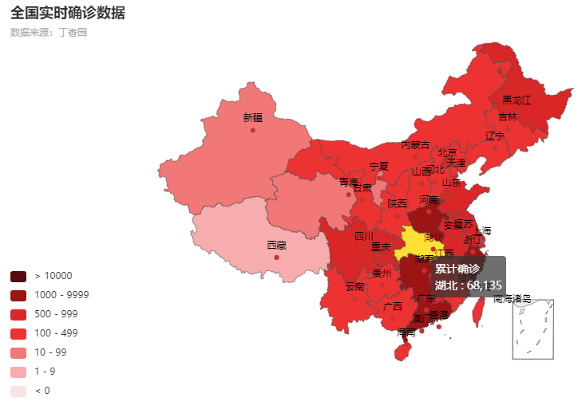
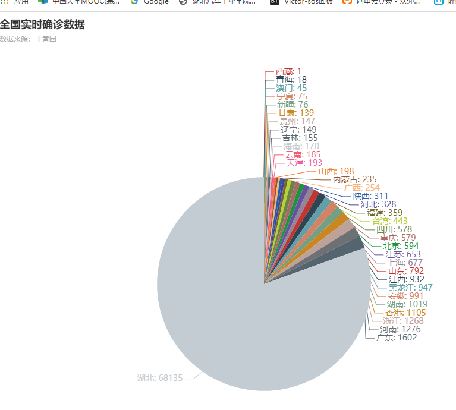
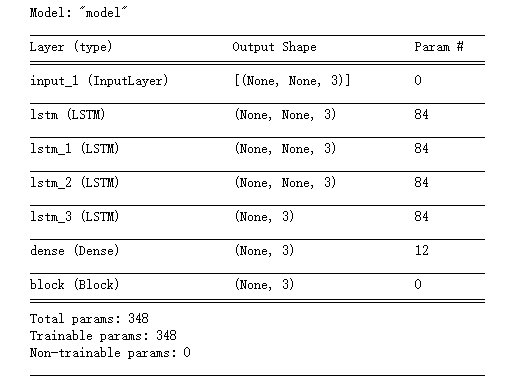
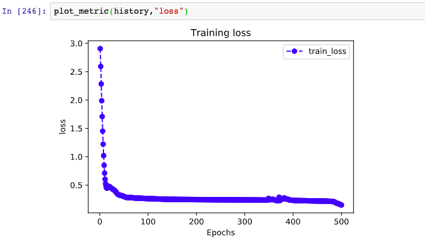

# **基于Python+Tensorflow2.0数据可视化+预测疫情结束时间**

## 摘要
国内的新冠肺炎疫情从发现至今已经持续5个多月了，这场起源于吃野味的灾难给大家的生活造成了诸多方面的影响，爬取疫情数据并通过pyecharts绘制增长曲线，实时确诊以及饼状图。通过TensorFlow建立RNN模型，处理并得到预测结果

## 一：新冠疫情可视化
```python
import json
import re
import requests
import datetime

today = datetime.date.today().strftime('%Y%m%d')   

def crawl_dxy_data():
    response = requests.get('https://ncov.dxy.cn/ncovh5/view/pneumonia') 
    print(response.status_code)                                          


    try:
        url_text = response.content.decode()                             
        #print(url_text)
        url_content = re.search(r'window.getAreaStat = (.*?)}]}catch',   
                                url_text, re.S)                          
        texts = url_content.group()                                     
        content = texts.replace('window.getAreaStat = ', '').replace('}catch', '') 
        json_data = json.loads(content)                                         
        with open('data/' + today + '.json', 'w', encoding='UTF-8') as f:
            json.dump(json_data, f, ensure_ascii=False)
    except:
        print('<Response [%s]>' % response.status_code)


def crawl_statistics_data():

    with open('data/'+ today + '.json', 'r', encoding='UTF-8') as file:
        json_array = json.loads(file.read())

    statistics_data = {}
    for province in json_array:
        response = requests.get(province['statisticsData'])
        try:
            statistics_data[province['provinceShortName']] = json.loads(response.content.decode())['data']
        except:
            print('<Response [%s]> for url: [%s]' % (response.status_code, province['statisticsData']))

    with open("data/statistics_data.json", "w", encoding='UTF-8') as f:
        json.dump(statistics_data, f, ensure_ascii=False)


if __name__ == '__main__':
    crawl_dxy_data()
    crawl_statistics_data()

```
通过requests请求丁香园疫情实时播报，将实时数据保存到data目录下，并存为JSON文件

---

**Echarts** 是一个由百度开源的数据可视化工具，凭借着良好的交互性，精巧的图表设计，得到了众多开发者的认可。而 Python 是一门富有表达力的语言，很适合用于数据处理。当数据分析遇上数据可视化时，**pyecharts** 诞生了

```python
import json
import datetime
from pyecharts.charts import Map
from pyecharts import options as opts

today = datetime.date.today().strftime('%Y%m%d')   
datafile = 'data/'+ today + '.json'
with open(datafile, 'r', encoding='UTF-8') as file:
    json_array = json.loads(file.read())

china_data = []
for province in json_array:
    china_data.append((province['provinceShortName'], province['confirmedCount']))
china_data = sorted(china_data, key=lambda x: x[1], reverse=True)                 

print(china_data)

pieces = [
    {'min': 10000, 'color': '#540d0d'},
    {'max': 9999, 'min': 1000, 'color': '#9c1414'},
    {'max': 999, 'min': 500, 'color': '#d92727'},
    {'max': 499, 'min': 100, 'color': '#ed3232'},
    {'max': 99, 'min': 10, 'color': '#f27777'},
    {'max': 9, 'min': 1, 'color': '#f7adad'},
    {'max': 0, 'color': '#f7e4e4'},
]
labels = [data[0] for data in china_data]
counts = [data[1] for data in china_data]

m = Map()
m.add("累计确诊", [list(z) for z in zip(labels, counts)], 'china')


m.set_series_opts(label_opts=opts.LabelOpts(font_size=12),
                  is_show=False)

m.set_global_opts(title_opts=opts.TitleOpts(title='全国实时确诊数据',
                                            subtitle='数据来源：丁香园'),
                  legend_opts=opts.LegendOpts(is_show=False),
                  visualmap_opts=opts.VisualMapOpts(pieces=pieces,
                                                    is_piecewise=True,   
                                                    is_show=True))       
m.render(path='/home/aistudio/data/全国实时确诊数据.html')

```
设置全局配置项，系列配置项，自定义特别的样式并生成**标题，动画，坐标轴，图例**  
最后生成html如图所示：   



---

```python
import json
import datetime
from pyecharts.charts import Map
from pyecharts import options as opts

today = datetime.date.today().strftime('%Y%m%d')   #20200315
datafile = 'data/'+ today + '.json'
with open(datafile, 'r', encoding='UTF-8') as file:
    json_array = json.loads(file.read())

with open('/home/aistudio/data/data24815/pycharts_city.txt', 'r', encoding='UTF-8') as f:
    defined_cities = [line.strip() for line in f.readlines()]


def format_city_name(name, defined_cities):
    for defined_city in defined_cities:
        if len((set(defined_city) & set(name))) == len(name):
            name = defined_city
            if name.endswith('市') or name.endswith('区') or name.endswith('县') or name.endswith('自治州'):
                return name
            return name + '市'
    return None


province_name = '湖北'
for province in json_array:
    if province['provinceName'] == province_name or province['provinceShortName'] == province_name:
        json_array_province = province['cities']
        hubei_data = [(format_city_name(city['cityName'], defined_cities), city['confirmedCount']) for city in
                      json_array_province]
        hubei_data = sorted(hubei_data, key=lambda x: x[1], reverse=True)

        print(hubei_data)

labels = [data[0] for data in hubei_data]
counts = [data[1] for data in hubei_data]
pieces = [
    {'min': 10000, 'color': '#540d0d'},
    {'max': 9999, 'min': 1000, 'color': '#9c1414'},
    {'max': 999, 'min': 500, 'color': '#d92727'},
    {'max': 499, 'min': 100, 'color': '#ed3232'},
    {'max': 99, 'min': 10, 'color': '#f27777'},
    {'max': 9, 'min': 1, 'color': '#f7adad'},
    {'max': 0, 'color': '#f7e4e4'},
]

m = Map()
m.add("累计确诊", [list(z) for z in zip(labels, counts)], '湖北')
m.set_series_opts(label_opts=opts.LabelOpts(font_size=12),
                  is_show=False)
m.set_global_opts(title_opts=opts.TitleOpts(title='湖北省实时确诊数据',
                                            subtitle='数据来源：丁香园'),
                  legend_opts=opts.LegendOpts(is_show=False),
                  visualmap_opts=opts.VisualMapOpts(pieces=pieces,
                                                    is_piecewise=True,
                                                    is_show=True))
m.render(path='/home/aistudio/data/湖北省实时确诊数据.html')
```
分析湖北省实时确诊数据，读取原始数据文件，读入规范化城市的名称。  
定义每个地区的**标签及图例**，并存为html  


---

```python
import numpy as np
import json
from pyecharts.charts import Line
from pyecharts import options as opts

datafile = 'data/statistics_data.json'
with open(datafile, 'r', encoding='UTF-8') as file:
    json_dict = json.loads(file.read())

statistics__data = {}
for province in json_dict:
    statistics__data[province] = []
    for da in json_dict[province]:
        if da['dateId'] >= 20200201:
            statistics__data[province].append(da['confirmedIncr'])

dateId = [str(da['dateId'])[4:6] + '-' + str(da['dateId'])[6:8] for da in json_dict['湖北'] if
          da['dateId'] >= 20200201]

all_statis = np.array([0] * len(dateId))
for province in statistics__data:
    all_statis = all_statis + np.array(statistics__data[province])

all_statis = all_statis.tolist()

hubei_statis = statistics__data['湖北']

other_statis = [all_statis[i] - hubei_statis[i] for i in range(len(dateId))]

line = Line()
line.add_xaxis(dateId)
line.add_yaxis("全国新增确诊病例",   
                all_statis,     
                is_smooth=True,   
               linestyle_opts=opts.LineStyleOpts(width=4, color='#B44038')
               itemstyle_opts=opts.ItemStyleOpts(color='#B44038',          
                                                 border_color="#B44038",   
                                                 border_width=10))         
line.add_yaxis("湖北新增确诊病例", hubei_statis, is_smooth=True,
               linestyle_opts=opts.LineStyleOpts(width=2, color='#4E87ED'),
               label_opts=opts.LabelOpts(position='bottom'),              
               itemstyle_opts=opts.ItemStyleOpts(color='#4E87ED',
                                                 border_color="#4E87ED",
                                                 border_width=3))
line.add_yaxis("其他省份新增病例", other_statis, is_smooth=True,
               linestyle_opts=opts.LineStyleOpts(width=2, color='#F1A846'),
               label_opts=opts.LabelOpts(position='bottom'),             
               itemstyle_opts=opts.ItemStyleOpts(color='#F1A846',
                                                 border_color="#F1A846",
                                                 border_width=3))
line.set_global_opts(title_opts=opts.TitleOpts(title="新增确诊病例", subtitle='数据来源：丁香园'),
                     yaxis_opts=opts.AxisOpts(max_=16000, min_=1, type_="log",   
                                              splitline_opts=opts.SplitLineOpts(is_show=True),
                                              axisline_opts=opts.AxisLineOpts(is_show=True)))
line.render(path='/home/aistudio/data/新增确诊趋势图.html')

```
分析各省市的新增确诊数据，并绘制日期列表和**全国新增趋势，绘制图例，线样式配置项，图元样式配置项，颜色，图元的大小**。并保存为html


---

```python
import json
import datetime
from pyecharts.charts import Map, Pie
from pyecharts import options as opts

today = datetime.date.today().strftime('%Y%m%d')   
datafile = 'data/'+ today + '.json'
with open(datafile, 'r', encoding='UTF-8') as file:
    json_array = json.loads(file.read())


china_data = []
for province in json_array:
    china_data.append((province['provinceShortName'], province['confirmedCount']))
china_data = sorted(china_data, key=lambda x: x[1], reverse=False)                 

print(china_data)
labels = [data[0] for data in china_data]
counts = [data[1] for data in china_data]

m = Pie(init_opts=opts.InitOpts(height='900px'))
m.add("累计确诊", [list(z) for z in zip(labels, counts)], center=["50%", "50%"], radius=[None, '40%'])
m.set_series_opts(label_opts=opts.LabelOpts(formatter="{b}: {c}", font_size=14),
                  is_show=False)


m.set_global_opts(title_opts=opts.TitleOpts(title='全国实时确诊数据',
                                            subtitle='数据来源：丁香园'),
                  legend_opts=opts.LegendOpts(is_show=False, type_="scroll", pos_left="80%", orient="horizontal"),
                  )
m.render(path='./data/饼状图.html')
```
读取原始数据文件，初始化配置项，设置饼图**中心坐标，半径，全局配置项**，并合成html，传入路径参数  


## 二：准备数据
通过网易API调用，相比较其他方式较为完整，并且中国数据包含所有历史数据，方便分析

``` python
import numpy as np
import pandas as pd 
import matplotlib.pyplot as plt
import tensorflow as tf 
from tensorflow.keras import models,layers,losses,metrics,callbacks 
```

导入**Numpy，Pandas，Matplotlib，TensorFlow，keras**包

``` python
%matplotlib inline
%config InlineBackend.figure_format = 'svg'

df = pd.read_csv(r"C:\Users\Victor-sos\Desktop\yq\covid-19.csv",sep = "\t")
df.plot(x = "date",y = ["confirmed_num","cured_num","dead_num"],figsize=(10,6))
plt.xticks(rotation=60)
```

通过**Pandas**库遍历**CSV**将折线图描绘出来并赋予图例


``` python
dfdata = df.set_index("date")
dfdiff = dfdata.diff(periods=1).dropna()
dfdiff = dfdiff.reset_index("date")

dfdiff.plot(x = "date",y = ["confirmed_num","cured_num","dead_num"],figsize=(10,6))
plt.xticks(rotation=60)
dfdiff = dfdiff.drop("date",axis = 1).astype("float32")
```
通过确诊人数，治愈人数，死亡人数绘制出历史日期折线图


``` python
WINDOW_SIZE = 8

def batch_dataset(dataset):
    dataset_batched = dataset.batch(WINDOW_SIZE,drop_remainder=True)
    return dataset_batched

ds_data = tf.data.Dataset.from_tensor_slices(tf.constant(dfdiff.values,dtype = tf.float32)) \
   .window(WINDOW_SIZE,shift=1).flat_map(batch_dataset)

ds_label = tf.data.Dataset.from_tensor_slices(
    tf.constant(dfdiff.values[WINDOW_SIZE:],dtype = tf.float32))

ds_train = tf.data.Dataset.zip((ds_data,ds_label)).batch(38).cache()
```
用某日前8天窗口数据作为输入预测该日数据，同时因为该数据较小，可以放入一个Batch中，进而提升性能

## 三：定义模型

``` python
class Block(layers.Layer):
    def __init__(self, **kwargs):
        super(Block, self).__init__(**kwargs)
 
    def call(self, x_input,x):
        x_out = tf.maximum((1+x)*x_input[:,-1,:],0.0)
        return x_out
 
    def get_config(self):  
        config = super(Block, self).get_config()
        return config
```

因为到新增确诊，新增治愈，新增死亡人数数据不可能小于0

``` python
tf.keras.backend.clear_session()

x_input = layers.Input(shape = (None,3),dtype = tf.float32)

x = layers.LSTM(3,return_sequences = True,input_shape=(None,3))(x_input)
x = layers.LSTM(3,return_sequences = True,input_shape=(None,3))(x)
x = layers.LSTM(3,return_sequences = True,input_shape=(None,3))(x)
x = layers.LSTM(3,input_shape=(None,3))(x)
x = layers.Dense(3)(x)

 
x = Block()(x_input,x)
model = models.Model(inputs = [x_input],outputs = [x])
model.summary()
```



## 四：训练模型
``` python
class MSPE(losses.Loss):
    def call(self,y_true,y_pred):
        err_percent = (y_true - y_pred)**2/(tf.maximum(y_true**2,1e-7))
        mean_err_percent = tf.reduce_mean(err_percent)
        return mean_err_percent
    
    def get_config(self):
        config = super(MSPE, self).get_config()
        return config
```
接下来定义损失函数
``` python

class MSPE(losses.Loss):
    def call(self,y_true,y_pred):
        err_percent = (y_true - y_pred)**2/(tf.maximum(y_true**2,1e-7))
        mean_err_percent = tf.reduce_mean(err_percent)
        return mean_err_percent
 
    def get_config(self):
        config = super(MSPE, self).get_config()
        return config
```

``` python
optimizer = tf.keras.optimizers.Adam(learning_rate=0.01)

model.compile(optimizer=optimizer,loss=MSPE(name = "MSPE"))

logdir = "C:/Users/Victor-sos/Downloads/Fblack007-eat_tensorflow2_in_30_days-master/eat_tensorflow2_in_30_days/data/keras_model/"+datetime.datetime.now().strftime("%Y%m%d-%H%M%S")

tb_callback = tf.keras.callbacks.TensorBoard(logdir, histogram_freq=1)

lr_callback = tf.keras.callbacks.ReduceLROnPlateau(monitor="loss",factor = 0.5, patience = 100)

stop_callback = tf.keras.callbacks.EarlyStopping(monitor = "loss", patience= 200)
callbacks_list = [tb_callback,lr_callback,stop_callback]

history = model.fit(ds_train,epochs=500,callbacks = callbacks_list)
```
如果**loss在100个epoch**后没有提升，学习率减半  
当**loss在200个epoch**后没有提升，则提前终止训练


## 五：评估模型

``` python
%matplotlib inline
%config InlineBackend.figure_format = 'svg'
 
import matplotlib.pyplot as plt
 
def plot_metric(history, metric):
    train_metrics = history.history[metric]
    epochs = range(1, len(train_metrics) + 1)
    plt.plot(epochs, train_metrics, 'bo--')
    plt.title('Training '+ metric)
    plt.xlabel("Epochs")
    plt.ylabel(metric)
    plt.legend(["train_"+metric])
    plt.show()
```
评估模型一般要设置验证集或者测试集，由于此例数据较少，我们仅仅可视化损失函数在训练集上的迭代情况



## 六：使用模型
``` python

dfresult = dfdiff[["confirmed_num","cured_num","dead_num"]].copy()
dfresult.tail()
```
使用**dfresult**记录现有数据以及此后预测的疫情数据

``` python
for i in range(100):
    arr_predict = model.predict(tf.constant(tf.expand_dims(dfresult.values[-38:,:],axis = 0)))
 
    dfpredict = pd.DataFrame(tf.cast(tf.floor(arr_predict),tf.float32).numpy(),
                columns = dfresult.columns)
    dfresult = dfresult.append(dfpredict,ignore_index=True)
```
预测此后**100天**的新增走势,将其结果添加到**dfresult**中

---

``` python
dfresult.query("confirmed_num==0").head()
 
```
第**55天**开始新增确诊降为0，第**45天**对应3月10日，也就是**10天**后，即预计3月20日新增确诊降为0

*该预测偏乐观*

---

```python
dfresult.query("cured_num==0").head()
 
```
第**164天**开始新增治愈降为0，第**45天**对应3月10日，也就是大概**4个月**后，即7月10日左右全部治愈。  

*该预测偏悲观，并且存在问题，如果将每天新增治愈人数加起来，将超过累计确诊人数。*

---

```python
dfresult.query("dead_num==0").head()
 
```

第**60天**开始，新增死亡降为0，第**45天**对应3月10日，也就是大概**15天**后，即20200325

*该预测较为合理*

---

## 七：保存模型

```python
model.save('./data/tf_model_savedmodel', save_format="tf")

print('export saved model.')

model_loaded = tf.keras.models.load_model('C:/Users/Victor-sos/Downloads/Fblack007-eat_tensorflow2_in_30_days-master/eat_tensorflow2_in_30_days/data/keras_model/',compile=False)

optimizer = tf.keras.optimizers.Adam(learning_rate=0.001)

model_loaded.compile(optimizer=optimizer,loss=MSPE(name = "MSPE"))

model_loaded.predict(ds_train)
```

  

保存后的文件如图，包含一个**pb预测文件**以及**数据和json数组** 


## 八：结果分析
```
在现如今的时代，深度学习正在逐步走进人们生活的的方方面面，同时也充斥着人工智能领域不断前进和发展。其发展的迅速，能给我们带来极大的便利。  

通过本门课程的学习，加上上个学期对深度学习框架的了解，逐渐尅是入门了。从开始的Mnist到现在的数据可视化，车牌识别，也慢慢的见证了深度学习强大所在。深度学习可以从少量的数据中快速准确的获取特征，进而减少每个特征提取器的工作量，提升了学习的效率。

从开始的人工智能定义到发展史，再到神经网络的一些基本元素,接着学习了线性回归，线性分类，非线性回归，非线性分类。进而演变到DNN,RNN,CNN等推理模型。可以说内容及其丰富，对于现在的我来说还没达到一下能够完全接受的程度。希望在今后的学习中能够更加深层次的了解。
```

## 参考文献
[1] https://blog.csdn.net/BF02jgtRS00XKtCx/article/details/104421616  
[2] https://echarts.apache.org/zh/index.html    
[3] https://blog.csdn.net/wuShiJingZuo/article/details/105321173  
[4] https://www.cnblogs.com/Nayears/p/12166869.html  
