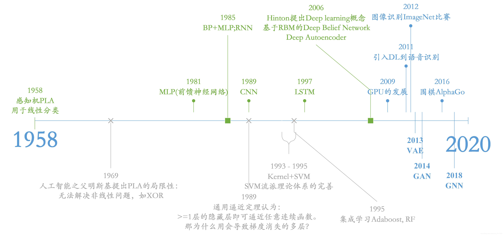

#                       
设计报告
 
## 1. 深度学习简介
深度学习(DL, Deep Learning)是机器学习(ML, Machine Learning)领域中一个新的研究方向，它被引入机器学习使其更接近于最初的目标——人工智能(AI, Artificial Intelligence)。

深度学习是学习样本数据的内在规律和表示层次，这些学习过程中获得的信息对诸如文字，图像和声音等数据的解释有很大的帮助。它的最终目标是让机器能够像人一样具有分析学习能力，能够识别文字、图像和声音等数据。 深度学习是一个复杂的机器学习算法，在语音和图像识别方面取得的效果，远远超过先前相关技术。

深度学习在搜索技术，数据挖掘，机器学习，机器翻译，自然语言处理，多媒体学习，语音，推荐和个性化技术，以及其他相关领域都取得了很多成果。深度学习使机器模仿视听和思考等人类的活动，解决了很多复杂的模式识别难题，使得人工智能相关技术取得了很大进步。

## 2.特点
 区别于传统的浅层学习，深度学习的不同在于：
 
(1)强调了模型结构的深度，通常有5层、6层，甚至10多层的隐层节点；

(2)明确了特征学习的重要性。也就是说，通过逐层特征变换，将样本在原空间的特征表示变换到一个新特征空间，从而使分类或预测更容易。与人工规则构造特征的方法相比，利用大数据来学习特征，更能够刻画数据丰富的内在信息。 

通过设计建立适量的神经元计算节点和多层运算层次结构，选择合适的输人层和输出层，通过网络的学习和调优，建立起从输入到输出的函数关系，虽然不能100%找到输入与输出的函数关系，但是可以尽可能的逼近现实的关联关系。使用训练成功的网络模型，就可以实现我们对复杂事务处理的自动化要求。

## 3.深度学习的训练过程

##  自下上升的非监督学习
就是从底层开始，一层一层地往顶层训练。采用无标定数据（有标定数据也可）分层训练各层参数，这一步可以看作是一个无监督训练过程，这也是和传统神经网络区别最大的部分，可以看作是特征学习过程。具体的，先用无标定数据训练第一层，训练时先学习第一层的参数，这层可以看作是得到一个使得输出和输入差别最小的三层神经网络的隐层，由于模型容量的限制以及稀疏性约束，使得得到的模型能够学习到数据本身的结构，从而得到比输入更具有表示能力的特征；在学习得到n-l层后，将n-l层的输出作为第n层的输入，训练第n层，由此分别得到各层的参数。 

### 自顶向下的监督学习
就是通过带标签的数据去训练，误差自顶向下传输，对网络进行微调。基于第一步得到的各层参数进一步优调整个多层模型的参数，这一步是一个有监督训练过程。第一步类似神经网络的随机初始化初值过程，由于第一步不是随机初始化，而是通过学习输入数据的结构得到的，因而这个初值更接近全局最优，从而能够取得更好的效果。所以深度学习的良好效果在很大程度上归功于第一步的特征学习的过程。 

## 4.深度学习的发展历程

下图是深度学习发展的历程
 

## 5.典型深度学习网络模型总结
 ### . LeNet

+ xavier：神经网络初始化方法
+ LeNet第一层是32*32大小的图像，而caffe中mnist数据库为28*28，这样做的原因是希望潜在的明显特征，
+ 如笔画断续、角点能够出现在高层特征监测子感受野的中心。

### . AlexNet
+ 	网络模型包含 60 million 的参数，65000 neurons，五 个卷积层，3个全连接层
+ 	最大池化，LRN(用在最大池化之前卷积的ReLU结果之后)
	Dropout：用在前两个全连接层上，降低过拟合，提高准确率。
+ 采用ImageNet数据集，因为AlexNet需要使用固定大小的图像作为输入，所以需要对原始图像进行剪裁，剪裁成大小为256*256的尺寸
+ 网络架构：
	5个卷积层：在两块GPU上进行

	3个全连接层：softmax交叉熵优化

	ReLU：训练速度更快

	LRN：有助于模型的泛化
	Overlapping Pooling：相比于非重叠池化，准确率更高，不容易过拟合
	降低过拟合

	4.1	Data Augmentation

		由上可知，剪裁出来的图像大小为256*256，而网络输入大小224*224
		这是为了对原始图像进行随机提取patches操作而故意为之的！
		第一种方法：平移和水平镜像
		第二种方法：使用PCA对图像像素强度进行调整

	4.2	Dropout

		通过随机操作可以减少神经元之间的co-adaptations，因此单个神经元不能仅依赖其他
		特定的一些神经元，而是被迫去学习更具有鲁棒性的特征来应对随机的神经元子集

Details of learning

	使用SGD方法进行优化、使用零均值高斯分布初始化权重、根据训练情况手动调节学习率

 Results
 Discussion
	网络深度很重要

### GoogLeNet

+ 介绍设计新的网络架构的目的及意义。GoogLeNet参数比AlexNet少了12倍，GoogLeNet的准确率不是因为深度够深，而是源于对深度卷积架构的创新。

+ GoogLeNet使用224*224的零均值RGB图像作为输入，最后一层全连接层主要是用来使网络输出适配到不同的标签集上，并不是希望提高分类精度.

+ Inception的引入允许使用更深的网络结构，而这带来的后果就是梯度传播能力够不够的问题，容易发生梯度消失，所以再网络中间层设置了新的loss层，标准与主网络输出的loss层标准相同，但在使用该网络进行预测推理的时候将中间层引入的loss层剔除掉不用.
+	使用SGD方法训练，实验证明光度扭曲有助于应对过拟合问题
+ 训练时使用大尺寸的图像剪裁成224*224大小的图像，还包括将图像进行镜像操作等，这样一张图生成144张图片用于训练。
+ 比赛结果强力的说明了，用稠密组件近似大的稀疏结构是可以行的方法。该结构的主要优点就是计算量小
	增加小的计算量就可以获得高质量的精度提高

## 6.人工神经网络

人工神经网络（Artificial Neural Networks，简写为ANNs）也简称为神经网络（NNs）或称作连接模型（Connection Model），它是一种模仿动物神经网络行为特征，进行分布式并行信息处理的算法数学模型。这种网络依靠系统的复杂程度，通过调整内部大量节点之间相互连接的关系，从而达到处理信息的目的。

## 7.神经网络算法
神经网络是所谓深度学习的一个基础，也是必备的知识点，他是以人脑中的神经网络作为启发，最著名的算法就是backpropagation算法，这里就简单的整理一下神经网络相关参数，和计算方法。

一、多层向前神经网络（Multilayer Feed-Forward Neural Network）
多层向前神经网络由一下几个部分组成：
输入层（input layer），隐藏层（Hidden layer），输出层（output layer）

特点如下：
1、每层由单元（units）组成

2、输入层是有训练集的实例特征向量传入

3、经过连接接点的权重（weight）传入下一层，一层的输出是下一层的输入

4、隐藏层的个数可以是任意的，输入层有一层，输出层有一层

5、每个单元也可以称之为神经结点，根据生物学来源定义

6、以上成为两层的神经网络，输入层是不算在里面的

7、一层中加权求和，然后根据非线性方程转化输出

8、作为多层向前神经网络，理论上，如果有足够的隐藏层，和足够的训练集，可以模拟出任何方程

##  8.基于tiny-dnn框架的MNIST识别

tiny-dnn是一个基于DNN的深度学习开源库，之前名字是tiny-cnn是基于CNN的，tiny-dnn与tiny-cnn相关又增加了些新层。此开源库很活跃，几乎每天都有新的提交，
因此下面详细介绍下tiny-dnn在windows7 64bit vs2013的编译及使用
步骤：
+ 从https://github.com/tiny-dnn/tiny-dnn 下载源码：

+ 源文件中已经包含了vs2013工程，vc/vc12/tiny-dnn.sln，默认是win32的，这里新建一个x64的控制台工程tiny-dnn；

+ 仿照源工程，将相应.h文件加入到新控制台工程中，新加一个test_tiny-dnn.cpp文件

+ 仿照examples/mnist中test.cpp和train.cpp文件中的代码添加如下测试代码；

#include "funset.hpp"
#include <string>
#include <algorithm>
#include "tiny_dnn/tiny_dnn.h"
 
static void construct_net(tiny_dnn::network<tiny_dnn::sequential>& nn)
{
	// connection table [Y.Lecun, 1998 Table.1]
#define O true
#define X false

	static const bool tbl[] = {
		O, X, X, X, O, O, O, X, X, O, O, O, O, X, O, O,
		O, O, X, X, X, O, O, O, X, X, O, O, O, O, X, O,
		O, O, O, X, X, X, O, O, O, X, X, O, X, O, O, O,
		X, O, O, O, X, X, O, O, O, O, X, X, O, X, O, O,
		X, X, O, O, O, X, X, O, O, O, O, X, O, O, X, O,
		X, X, X, O, O, O, X, X, O, O, O, O, X, O, O, O
	};
#undef O
#undef X
 
	// by default will use backend_t::tiny_dnn unless you compiled
	// with -DUSE_AVX=ON and your device supports AVX intrinsics
	tiny_dnn::core::backend_t backend_type = tiny_dnn::core::default_engine();
 
	// construct nets: C: convolution; S: sub-sampling; F: fully connected
	nn << tiny_dnn::convolutional_layer<tiny_dnn::activation::tan_h>(32, 32, 5, 1, 6,  // C1, 1@32x32-in, 6@28x28-out
		tiny_dnn::padding::valid, true, 1, 1, backend_type)
		<< tiny_dnn::average_pooling_layer<tiny_dnn::activation::tan_h>(28, 28, 6, 2)   // S2, 6@28x28-in, 6@14x14-out
		<< tiny_dnn::convolutional_layer<tiny_dnn::activation::tan_h>(14, 14, 5, 6, 16, // C3, 6@14x14-in, 16@10x10-out
		connection_table(tbl, 6, 16),
		tiny_dnn::padding::valid, true, 1, 1, backend_type)
		<< tiny_dnn::average_pooling_layer<tiny_dnn::activation::tan_h>(10, 10, 16, 2)  // S4, 16@10x10-in, 16@5x5-out
		<< tiny_dnn::convolutional_layer<tiny_dnn::activation::tan_h>(5, 5, 5, 16, 120, // C5, 16@5x5-in, 120@1x1-out
		tiny_dnn::padding::valid, true, 1, 1, backend_type)
		<< tiny_dnn::fully_connected_layer<tiny_dnn::activation::tan_h>(120, 10,        // F6, 120-in, 10-out
		true, backend_type);
}
 
static void train_lenet(const std::string& data_dir_path)
{
	// specify loss-function and learning strategy
	tiny_dnn::network<tiny_dnn::sequential> nn;
	tiny_dnn::adagrad optimizer;
 
	construct_net(nn);
 
	std::cout << "load models..." << std::endl;
 
	// load MNIST dataset
	std::vector<tiny_dnn::label_t> train_labels, test_labels;
	std::vector<tiny_dnn::vec_t> train_images, test_images;
 
	tiny_dnn::parse_mnist_labels(data_dir_path + "/train-labels.idx1-ubyte", &train_labels);
	tiny_dnn::parse_mnist_images(data_dir_path + "/train-images.idx3-ubyte", &train_images, -1.0, 1.0, 2, 2);
	tiny_dnn::parse_mnist_labels(data_dir_path + "/t10k-labels.idx1-ubyte", &test_labels);
	tiny_dnn::parse_mnist_images(data_dir_path + "/t10k-images.idx3-ubyte", &test_images, -1.0, 1.0, 2, 2);
 
	std::cout << "start training" << std::endl;
 
	tiny_dnn::progress_display disp(static_cast<unsigned long>(train_images.size()));
	tiny_dnn::timer t;
	int minibatch_size = 10;
	int num_epochs = 30;
 
	optimizer.alpha *= static_cast<tiny_dnn::float_t>(std::sqrt(minibatch_size));
 
	// create callback
	auto on_enumerate_epoch = [&](){
		std::cout << t.elapsed() << "s elapsed." << std::endl;
		tiny_dnn::result res = nn.test(test_images, test_labels);
		std::cout << res.num_success << "/" << res.num_total << std::endl;
 
		disp.restart(static_cast<unsigned long>(train_images.size()));
		t.restart();
	};
 
	auto on_enumerate_minibatch = [&](){
		disp += minibatch_size;
	};
 
	// training
	nn.train<tiny_dnn::mse>(optimizer, train_images, train_labels, minibatch_size, num_epochs, on_enumerate_minibatch, on_enumerate_epoch);
 
	std::cout << "end training." << std::endl;
 
	// test and show results
	nn.test(test_images, test_labels).print_detail(std::cout);
 
	// save network model & trained weights
	nn.save(data_dir_path + "/LeNet-model");
}
 
// rescale output to 0-100
template <typename Activation>
static double rescale(double x)
{
	Activation a;
	return 100.0 * (x - a.scale().first) / (a.scale().second - a.scale().first);
}
 
static void convert_image(const std::string& imagefilename, double minv, double maxv, int w, int h, tiny_dnn::vec_t& data)
{
	tiny_dnn::image<> img(imagefilename, tiny_dnn::image_type::grayscale);
	tiny_dnn::image<> resized = resize_image(img, w, h);
 
	// mnist dataset is "white on black", so negate required
	std::transform(resized.begin(), resized.end(), std::back_inserter(data),
		[=](uint8_t c) { return (255 - c) * (maxv - minv) / 255.0 + minv; });
}
 
int test_dnn_mnist_train()
{
	std::string data_dir_path = "E:/GitCode/NN_Test/data";
	train_lenet(data_dir_path);
 
	return 0;
}
 
int test_dnn_mnist_predict()
{
	std::string model { "E:/GitCode/NN_Test/data/LeNet-model" };
	std::string image_path { "E:/GitCode/NN_Test/data/images/"};
	int target[10] { 0, 1, 2, 3, 4, 5, 6, 7, 8, 9 };
 
	tiny_dnn::network<tiny_dnn::sequential> nn;
	nn.load(model);
 
	for (int i = 0; i < 10; i++) {
		std::string str = std::to_string(i);
		str += ".png";
		str = image_path + str;
 
		// convert imagefile to vec_t
		tiny_dnn::vec_t data;
		convert_image(str, -1.0, 1.0, 32, 32, data);
 
		// recognize
		auto res = nn.predict(data);
		std::vector<std::pair<double, int> > scores;
 
		// sort & print top-3
		for (int j = 0; j < 10; j++)
			scores.emplace_back(rescale<tiny_dnn::tan_h>(res[j]), j);
 
		std::sort(scores.begin(), scores.end(), std::greater<std::pair<double, int>>());
 
		for (int j = 0; j < 3; j++)
			fprintf(stdout, "%d: %f;  ", scores[j].second, scores[j].first);
		fprintf(stderr, "\n");
 
		// save outputs of each layer
		for (size_t j = 0; j < nn.depth(); j++) {
			auto out_img = nn[j]->output_to_image();
			auto filename = image_path + std::to_string(i) + "_layer_" + std::to_string(j) + ".png";
			out_img.save(filename);
		}
 
		// save filter shape of first convolutional layer
		auto weight = nn.at<tiny_dnn::convolutional_layer<tiny_dnn::tan_h>>(0).weight_to_image();
		auto filename = image_path + std::to_string(i) + "_weights.png";
		weight.save(filename);
 
		fprintf(stdout, "the actual digit is: %d, correct digit is: %d \n\n", scores[0].second, target[i]);
	}
 
	return 0;
}

 + 运行程序，train时，运行结果如下图所示，准确率达到99%以上：
 

 + 对生成的model进行测试，通过画图工具，每个数字生成一张图像，共10幅，如下图
 

 + 通过导入train时生成的model，对这10张图像进行识别，识别结果如下图，其中0,8,9
   被误识别为2,2,1.

      

## 9.总结
tiny-dnn是一个微小但强大的深度神经网络框架，与其他深度学习框架相比，tiny-dnn的最大优势在于其对外部软件的依赖性最小且易于安装。通过设计报告，我大致了解了tiny-dnn设计和实现的基本流程，在此过程中学习到了很多东西，对于深度学习来说这仅仅只是一点皮毛，通过本次设计报告让我感受到深度神经网络的强大功能，目前深度学习主要是在弱人工智能的发展中产生重要作用，尤其是特定的行业应用，如图像识别、自动驾驶和机器翻译等。未来深度学习是人工智能发展的主要驱动力。最后希望能在今后的学习中丰富自己的知识让自己能够更加了解深度学习和神经网络的算法应用。

	
