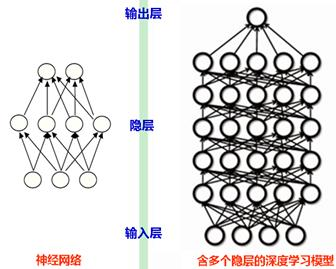
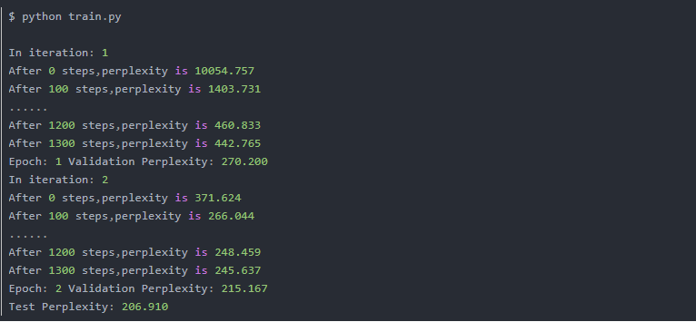

　<center><font size= 6>深度学习报告</font></center>
# <font size=4 >一、什么是深度学习</font>
        深度学习作为机器学习算法研究中的一个新的技术，其动机在于建立、模拟人脑进行分析学习的神经网络。
        深度学习是相对于简单学习而言的，目前多数分类、回归等学习算法都属于简单学习或者浅层结构，浅层结构通常只包含1层或2层的非线性特征转换层，典型的浅层结构有高斯混合模型(GMM)、隐马尔科夫模型(HMM)、条件随机域(CRF)、最大熵模型(MEM)、逻辑回归(LR)、支持向量机(SVM)和多层感知器(MLP)。  
        其中，最成功的分类模型是SVM，SVM使用一个浅层线性模式分离模型，当不同类别的数据向量在低维空间无法划分时，SVM会将它们通过核函数映射到高维空间中并寻找分类最优超平面。          

  
  <center>图1 SVM由低维转成高维</center>
浅层结构学习模型的相同点是采用一层简单结构将原始输入信号或特征转换到特定问题的特征空间中。浅层模型的局限性对复杂函数的表示能力有限，针对复杂分类问题其泛化能力受到一定的制约，比较难解决一些更加复杂的自然信号处理问题，例如人类语音和自然图像等。而深度学习可通过学习一种深层非线性网络结构，从而模拟更加复杂的函数，但同时也使得待学习的参数激增，所以往往需要的训练数据集很大。

   
<center>图2.传统的神经网络和深度神经网络</center> 

# 二、深度学习与人工神经网络
       现代深度学习架构大多数基于人工神经网络（ANN），并使用多层非线性处理单元进行特征提取和转换。每个连续层使用前一层的输出作为其输入。他们学到的东西构成了一个概念层次结构，每个层次都学会将其输入数据转换为抽象和复合的表征。
       这意味着对于图像，例如，输入可能是像素矩阵，而第一层可能编码边框并组成像素，然后下一层可能排列边，再下一层可能编码鼻子和眼睛，然后可能会识别图像包含人脸……虽然你可能需要进行一些微调，但是深度学习过程会自行学习将哪些特性放置在哪个级别。
       深度学习中的“深层”只是指数据转换的层数（它们具有实质的CAP，即从输入到输出的转换链）。对于前馈神经网络，CAP的深度是网络的深度和隐藏层的数量加1（输出层）。对于递归神经网络，一个信号可能会在一个层中传播不止一次，所以上限深度可能是无限的。大多数研究人员认为深度学习CAP depth >2。
## 2.1 卷积神经网络
       卷积神经网络（CNN）是最流行的神经网络类型之一。CNN使用输入卷积来学习输入数据的特性，并使用2D卷积层，这意味着这种类型的网络非常适合处理2D图像。
       CNN通过从图像中提取特征来工作，这意味着无需手动特征提取。这些特征没有经过训练，当网络训练一组图像时，它们重新学习，这使得深度学习模型对于计算机视觉任务非常准确。CNN通过数十或数百个隐藏层进行特征检测学习，每一层都增加了学习特征的复杂性。
## 2.2循环神经网络
       卷积神经网络通常用于处理图像，而循环神经网络（RNN）用于处理语言。RNN不只是将信息从一个层过滤到下一个层，它们具有内置的反馈回路，其中一层的输出可能被反馈到它之前的层中。这实际上为网络提供了一种记忆。
## 2.3 生成对抗性网络
        在生成对抗性网络（GAN）中，两个神经网络互相竞争。生成器网络试图创建令人信服的虚假数据，而鉴别器试图分辨虚假数据和真实数据之间的差异。
        在每个训练周期中，生成器在创建假数据方面做得更好，鉴别器在识别假数据方面做得更好。通过在训练中让两者相互竞争，两种网络都得到了改善。
# 三、【TensorFlow】LSTM（基于PTB的自然语言建模）
## 3.1 下载PTB数据集
官网下载
需要的 PTB 数据集就在解压之后的 data/ 文件夹下，data/ 文件夹下有7个文件，要用的只有3个：          
```
ptb.test.txt  
ptb.train.txt  
ptb.valid.txt   
```
 要读取 PTB 数据集需要用到 reader.py，reader.py 提供了两个函数用于读取和处理 PTB 数据集：  
ptb_raw_data(DATA_PATH)：读取原始数据
ptb_producer(raw_data,batch_size,num_steps)：用于将数据组织成大小为 batch_size，长度为 num_steps 的数据组
* 使用这两个函数
  ```
  import reader
  import tensorflow as tf
  DATA_PATH = 'simple-examples/data/'
  train_data, valid_data, test_data, _ = reader.ptb_raw_data(DATA_PATH)
  batch = reader.ptb_producer(train_data, 4, 5)
  with tf.Session() as sess:
    tf.global_variables_initializer().run()
    coord = tf.train.Coordinator()
    threads = tf.train.start_queue_runners(coord=coord)
    for i in range(2):
        x, y = sess.run(batch)
        print('x:', x)
        print('y:', y)
    coord.request_stop()
    coord.join(threads)
* 运行结果

## 3.2 完整代码
* 整个代码的结构如下：

PTBModel 类用于创建 LSTM 网络结构及维护其状态
run_epoch() 函数使用给定的 model 在数据集上运行 train_op 并返回 perplexity 值
main() 函数定义图的运行
```
import reader
import numpy as np
import tensorflow as tf
DATA_PATH = 'simple-examples/data/'  
VOCAB_SIZE = 10000  
HIDDEN_SIZE = 200 
NUM_LAYERS = 2 
LEARNING_RATE = 1.0 
KEEP_PROB = 0.5
MAX_GRAD_NORM = 5  
TRAIN_BATCH_SIZE = 20 
TRAIN_NUM_STEP = 35   
EVAL_BATCH_SIZE = 1  
EVAL_NUM_STEP = 1 
NUM_EPOCH = 2 
class PTBModel():
    def __init__(self, is_training, batch_size, num_steps):
        self.batch_size = batch_size
        self.num_steps = num_steps
        self.input_data = tf.placeholder(tf.int32, [batch_size, num_steps])
        self.targets = tf.placeholder(tf.int32, [batch_size, num_steps])
        lstm_cell = tf.contrib.rnn.BasicLSTMCell(HIDDEN_SIZE)
        if is_training:
            lstm_cell = tf.contrib.rnn.DropoutWrapper(
                lstm_cell, output_keep_prob=KEEP_PROB)
        cell = tf.contrib.rnn.MultiRNNCell([lstm_cell] * NUM_LAYERS)
        self.initial_state = cell.zero_state(batch_size, tf.float32)
        embedding = tf.get_variable('embedding', [VOCAB_SIZE, HIDDEN_SIZE])
        batch_size*num_steps*HIDDEN_SIZE
        inputs = tf.nn.embedding_lookup(embedding, self.input_data)
        if is_training:
            inputs = tf.nn.dropout(inputs, KEEP_PROB)
        outputs = []
        state = self.initial_state
        with tf.variable_scope('RNN'):
            for time_step in range(num_steps):
                if time_step > 0:
                    tf.get_variable_scope().reuse_variables()
                cell_output, state = cell(inputs[:, time_step, :],
                                          state)   
        output = tf.reshape(tf.concat(outputs, 1), [-1, HIDDEN_SIZE])
        weight = tf.get_variable('weight', [HIDDEN_SIZE, VOCAB_SIZE])
        bias = tf.get_variable('bias', [VOCAB_SIZE])
        logits = tf.matmul(output, weight) + bias
        loss = tf.contrib.legacy_seq2seq.sequence_loss_by_example(
            [logits],  
            [tf.reshape(self.targets, [-1])
             ], 
            [tf.ones([batch_size * num_steps], dtype=tf.float32)
             ] 
        )
        self.cost = tf.reduce_sum(loss) / batch_size
        self.final_state = state
        if not is_training:
            return
        trainable_variables = tf.trainable_variables()
        grads, _ = tf.clip_by_global_norm(
            tf.gradients(self.cost, trainable_variables),
            MAX_GRAD_NORM) 
        optimizer = tf.train.GradientDescentOptimizer(LEARNING_RATE)
        self.train_op = optimizer.apply_gradients(
            zip(grads, trainable_variables))
perplexity
def run_epoch(session, model, data_queue, train_op, output_log, epoch_size):
    total_costs = 0.0
    iters = 0
    state = session.run(model.initial_state)
    for step in range(epoch_size):
        feed_dict = {}
        x, y = session.run(data_queue)
        feed_dict[model.input_data] = x
        feed_dict[model.targets] = y
        for i, (c, h) in enumerate(model.initial_state):
            feed_dict[c] = state[i].c
            feed_dict[h] = state[i].h

        cost, state, _ = session.run(
            [model.cost, model.final_state, train_op], feed_dict=feed_dict
        )  
        total_costs += cost
        iters += model.num_steps
        if output_log and step % 100 == 0:
            print('After %d steps,perplexity is %.3f' %
                  (step, np.exp(total_costs / iters)))
    return np.exp(total_costs / iters)
def main(_):
    train_data, valid_data, test_data, _ = reader.ptb_raw_data(DATA_PATH)
    train_data_len = len(train_data)  
    train_batch_len = train_data_len // TRAIN_BATCH_SIZE  
    train_epoch_size = (train_batch_len - 1) // TRAIN_NUM_STEP  
    valid_data_len = len(valid_data)
    valid_batch_len = valid_data_len // EVAL_BATCH_SIZE
    valid_epoch_size = (valid_batch_len - 1) // EVAL_NUM_STEP
    test_data_len = len(test_data)
    test_batch_len = test_data_len // EVAL_BATCH_SIZE
    test_epoch_size = (test_batch_len - 1) // EVAL_NUM_STEP
    train_queue = reader.ptb_producer(train_data, train_model.batch_size,
                                      train_model.num_steps)
    valid_queue = reader.ptb_producer(valid_data, eval_model.batch_size,
                                      eval_model.num_steps)
    test_queue = reader.ptb_producer(test_data, eval_model.batch_size,
                                     eval_model.num_steps)
    initializer = tf.random_uniform_initializer(-0.05, 0.05)
    with tf.variable_scope(
            'language_model', reuse=None, initializer=initializer):
        train_model = PTBModel(True, TRAIN_BATCH_SIZE, TRAIN_NUM_STEP)
    with tf.variable_scope(
            'language_model', reuse=True, initializer=initializer):
        eval_model = PTBModel(False, EVAL_BATCH_SIZE, EVAL_NUM_STEP)
    with tf.Session() as sess:
        tf.global_variables_initializer().run()
        range_input_producer()
        coord = tf.train.Coordinator()
        threads = tf.train.start_queue_runners(sess=sess, coord=coord)
        for i in range(NUM_EPOCH):
            print('In iteration: %d' % (i + 1))
            run_epoch(sess, train_model, train_queue, train_model.train_op,
                      True, train_epoch_size) 
            valid_perplexity = run_epoch(sess, eval_model, valid_queue,
                                         tf.no_op(), False,
                                         valid_epoch_size)  
            print('Epoch: %d Validation Perplexity: %.3f' % (i + 1,
                                                             valid_perplexity))
        test_perplexity = run_epoch(sess, eval_model, test_queue,
                                    tf.no_op(), False, test_epoch_size)
        print('Test Perplexity: %.3f' % test_perplexity)
        coord.request_stop()
        coord.join(threads)
if __name__ == '__main__':
    tf.app.run()
```
* 运行结果
  
